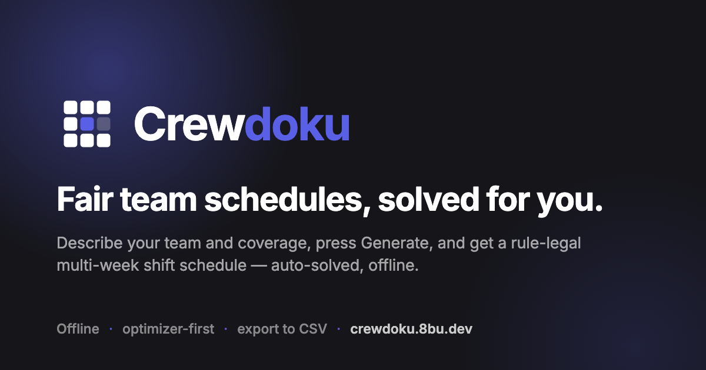

# Crewdoku

**Fair team schedules, solved for you.**

Crewdoku builds multi-week shift schedules for one team. Describe your people
and the coverage each shift needs, press **Generate**, and get a fair,
rule-legal roster you can tweak by hand and export. It runs entirely in your
browser — no server, no account, no data leaves your machine.

**Try it:** <https://crewdoku.8bu.dev>



## Why

Scheduling a shift team by hand means juggling coverage minimums, weekly-hour
caps, rest windows, time off, and "who did nights last week" — and redoing it
every time someone calls in sick. Most tools that automate this are hosted SaaS
built around accounts, roles, and approval workflows. Crewdoku is the opposite:
a single-user, offline app for the one person who owns the schedule. It is an
**app, not a platform**.

## Features

- **One-click solving** — a real mixed-integer solver ([HiGHS](https://highs.dev),
  compiled to WebAssembly) runs in a Web Worker and finds a legal schedule for
  the whole period at once. Cancel mid-solve; the board stays editable meanwhile.
- **Hard rules the solver never breaks**
  - coverage minimums and maximums per shift, per day
  - weekly hour caps
  - minimum rest between shifts
  - one shift per person per day
  - approved time off and recurring days off
- **Fairness goals it optimizes** — even spread of night and weekend shifts,
  shift preferences (wants/avoids, with team defaults), penalized shift-to-shift
  transitions, and minimal churn versus the previous schedule.
- **Honest infeasibility** — when the rules can't all be met, you get the
  conflicting rules and concrete relaxations to choose from, not a silent
  best-effort.
- **Hand editing with live checks** — every cell is editable; rule breaks and
  fairness stats update as you go.
- **Import** a roster from CSV/XLSX (paste or upload) or an existing schedule from CSV.
- **Export** as CSV, TSV, JSON, XLSX, or PDF, in team-grid or per-person layouts.
- **Multiple organizations and workspaces**, all stored locally in IndexedDB.
- **English and Vietnamese** UI.

## How it works

1. **Describe** — add people and teams, define your shifts, and set how many
   people each shift needs per weekday. Pick a starting template (ward, retail,
   office) or start blank.
2. **Generate** — the solver produces a full multi-week schedule that satisfies
   every hard rule and balances the fairness goals.
3. **Refine** — adjust cells by hand, regenerate with pinned changes kept, and
   export.

## Run it locally

Tested with Node 24 and [pnpm](https://pnpm.io) (pinned via `packageManager`).

```bash
git clone https://github.com/8bu/crewdoku.git
cd crewdoku
corepack enable pnpm
pnpm install
pnpm dev          # http://localhost:5173
```

## Self-host

The app is static files. Build it and serve `app/dist/` from anything that can
host a single-page app (fall back unknown paths to `index.html`):

```bash
pnpm build        # → app/dist/
```

The included [`app/wrangler.jsonc`](app/wrangler.jsonc) deploys it as Cloudflare
Workers static assets: `cd app && npx wrangler deploy`.

## Development

```
app/              The web app — Vite, React 19, TypeScript, Tailwind + daisyUI, Jotai.
packages/
  domain/         Entities, calendar, rules, and ports. Pure TypeScript, zero dependencies.
  solver/         MILP model and the HiGHS worker adapter.
  persistence/    IndexedDB storage and workspace files.
  harness/        UI-less end-to-end driver used by tests.
proto/            The original clickable prototype, kept as the behavior reference.
```

Engine packages are consumed as TypeScript source — no build step. The domain
package's rule checker doubles as an independent oracle for the solver in tests.

```bash
pnpm test         # vitest, every package
pnpm lint         # tsc --noEmit, every package
pnpm build        # vite build (app + proto)
pnpm dev:proto    # run the prototype instead of the app
```

Product direction and non-goals: [`VISION.md`](VISION.md).

## Contributing

Issues and pull requests are welcome. Keep changes small and focused, run
`pnpm lint` and `pnpm test` before opening a PR, and note that the product
scope is deliberately narrow — see the non-goals in `VISION.md` before
proposing accounts, roles, or multi-user features.

## License

[GNU AGPL-3.0](LICENSE). You may use, modify, and redistribute Crewdoku freely;
if you run a modified version as a network service, you must make its source
available to your users under the same license.
